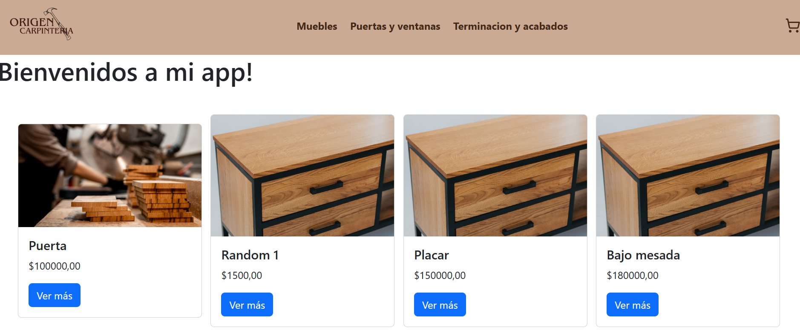

# 🪵 E-Commerce de Carpintería

Este proyecto es una tienda online desarrollada con **React** para una carpintería artesanal. Los usuarios pueden explorar productos, agregarlos al carrito y finalizar su compra mediante un formulario.

---

## 📸 Vista previa



## 🛠️ Instalación

1. Cloná el repositorio:
   ```bash
   git clone https://github.com/Yanina-Aranda/CreaTuLanding-Aranda.git
   cd CreaTuLanding-Aranda
2. Haga el comando `cd crea-tu-landing-aranda` para moverse a la carpeta del proyecto
3. Instale dependencias con el comando `npm install`
4. Para levantar la app en el sevidor local ejecute el comando `npm run dev`

## 💻 Version host

Si desea ver el proyecto online, puede ingresar al siguiente link: [Ecommerce]()

## 🚀 Librerias utilizadas

- [React Bootstrap](https://react-bootstrap.netlify.app/): utilizada para el styling de la app
- [React Router Dom](https://reactrouter.com/): utilizada para la navegacion por rutas 
- [Firebase](https://firebase.google.com/): utilizada como base de datos
- [React Hook Form](https://react-hook-form.com/): utilizada para la validacion del formulario
- [Yup](https://www.npmjs.com/package/yup): utilizada para la validacion del formulario
- [lucide-react](https://lucide.dev/guide/packages/lucide-react): utilizada para iconos